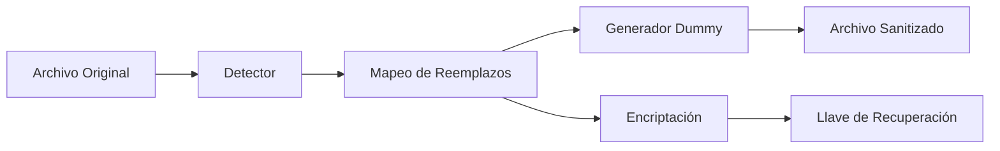

# Data Sanitizer 🔒

**Anonimización Reversible de Datos Sensibles**

Una aplicación de escritorio multiplataforma que permite procesar archivos de texto, identificar y reemplazar automáticamente datos sensibles con información dummy, y generar un sistema de recuperación seguro que permite restaurar los datos originales después del procesamiento externo.

[](https://www.python.org/downloads/)
[](https://opensource.org/licenses/MIT)
[](https://github.com/francomicalizzi/data-sanitizer)

## 🎯 Características Principales

- **🔍 Detección Automática**: Identifica 8+ tipos de datos sensibles usando patrones avanzados
- **🔒 Encriptación Segura**: Protección AES-256 con derivación de llaves PBKDF2
- **🔄 Recuperación Reversible**: Sistema de mapeo encriptado para restaurar datos originales
- **📁 Múltiples Formatos**: Soporte para texto, código, configuraciones, logs y más
- **🖥️ Multiplataforma**: Funciona en Windows, macOS y Linux
- **⚡ Alto Rendimiento**: Procesa archivos de hasta 50MB en menos de 30 segundos
- **🔐 Offline Completo**: No requiere conexión a internet, datos nunca salen del sistema local

## 🏗️ Tipos de Datos Detectados

### Información Personal
- ✅ Direcciones de email
- ✅ Números de teléfono (formatos internacionales)
- ✅ Nombres de personas
- ✅ Fechas de nacimiento
- ✅ Números de tarjetas de crédito
- ✅ Direcciones postales

### Información Técnica  
- ✅ Direcciones IP (IPv4/IPv6)
- ✅ URLs y endpoints de API
- ✅ Rutas de archivos y directorios (contextualmente inteligente)
- ✅ **API Keys y Tokens Específicos**:
  - GitHub Personal Access Tokens (`ghp_*`)
  - Google API Keys (`AIza*`)
  - AWS Access Keys (`AKIA*`)
  - HubSpot Tokens (`pat-*`)
  - Notion API Tokens (`ntn_*`)
  - JWT Tokens (`eyJ*`)
- ✅ Strings de conexión a bases de datos
- ✅ Claves SSH y certificados

### Información Corporativa
- ✅ Nombres de empresas y marcas
- ✅ Códigos de empleados
- ✅ Números de cuenta y datos financieros
- ✅ IDs de proyecto internos

## 🚀 Instalación Rápida

### Prerrequisitos
- Python 3.8 o superior
- pip (gestor de paquetes de Python)

### Paso a Paso

```bash
# 1. Clonar el repositorio
git clone https://github.com/francomicalizzi/data-sanitizer.git
cd data-sanitizer

# 2. Crear entorno virtual
python3 -m venv venv
source venv/bin/activate  # En Windows: venv\Scripts\activate

# 3. Instalar dependencias
python -m pip install -r requirements.txt

# 4. Probar la instalación
python cli.py --help
```

## 📋 Uso Rápido

### Interfaz de Línea de Comandos (CLI)

```bash
# Activar entorno virtual
source venv/bin/activate

# Scripts convenientes
./run_cli.sh demo                    # Demo completo
./run_cli.sh test                    # Crear archivo de prueba 
./run_gui.sh                         # Abrir interfaz gráfica

# Comandos directos
python cli.py process mi_archivo.txt --password mi_contraseña
python cli.py recover archivo_sanitizado.txt llave_recuperacion.json --password mi_contraseña
```

### Interfaz Gráfica (GUI)

```bash
# macOS: Instalar tkinter
brew install python-tk

# Ubuntu/Debian: Instalar tkinter
sudo apt-get install python3-tk

# Windows: tkinter viene incluido con Python

# Ejecutar interfaz gráfica
./run_gui.sh
# O directamente:
source venv/bin/activate && python main.py
```

**Características de la GUI:**
- 🖱️ Interfaz intuitiva con drag & drop
- 👁️ Vista previa de cambios antes de procesar
- 📊 Estadísticas detalladas en tiempo real
- 🔑 Ventana dedicada para recuperación de archivos
- 💾 Gestión de archivos integrada

## 🔧 Ejemplos de Uso

### Ejemplo 1: Sanitizar Código Fuente

```bash
# Procesar archivo Python con credenciales
python cli.py process examples/input/code_example.py --output examples/output

# El archivo resultante tendrá:
# - IPs reemplazadas: 192.168.1.50 → 192.168.1.1
# - Emails reemplazados: developer@mycompany.com → user001@example.com
# - URLs reemplazadas: https://hooks.slack.com/... → https://example1.com/path
```

### Ejemplo 2: Sanitizar Archivo de Configuración

```bash
# Procesar archivo JSON con configuraciones sensibles
python cli.py process examples/input/config_example.json --password prod2024

# Genera:
# - config_example_sanitized_[timestamp].json (archivo limpio)
# - config_example_recovery_key_[timestamp].json (llave de recuperación)
```

### Ejemplo 3: Procesar Logs de Servidor

```bash
# Sanitizar logs con información de usuarios
python cli.py process examples/input/log_example.log

# Reemplaza automáticamente:
# - IPs de clientes
# - Emails de usuarios  
# - Tokens de sesión
# - Rutas de archivos sensibles
```

## 📁 Estructura del Proyecto

```
data-cleaner/
├── src/                        # 🔧 Código fuente principal
│   ├── core/                   # Lógica de negocio central
│   │   ├── detector.py         # Detección de datos sensibles
│   │   ├── security.py         # Encriptación y seguridad
│   │   ├── processor.py        # Procesamiento de archivos
│   │   └── recovery.py         # Sistema de recuperación
│   ├── gui/                    # Interfaz gráfica
│   └── utils/                  # Utilidades auxiliares
├── examples/                   # 📂 Archivos de ejemplo
│   ├── input/                  # Archivos de entrada para testing
│   │   ├── test_file.txt       # Documento con datos sensibles
│   │   ├── code_example.py     # Código Python con credenciales
│   │   ├── config_example.json # Configuración con secretos
│   │   └── log_example.log     # Logs de servidor
│   └── output/                 # Resultados de procesamiento
├── data/                       # 🗃️ Datos de la aplicación
│   ├── patterns/               # Patrones de detección personalizados
│   └── keys/                   # Almacenamiento de llaves locales
├── config/                     # ⚙️ Configuraciones
├── temp/                       # 📄 Archivos temporales
├── logs/                       # 📋 Logs de la aplicación
├── docs/                       # 📚 Documentación adicional
├── venv/                       # 🐍 Entorno virtual Python
├── main.py                     # 🖥️ Entrada principal (GUI)
├── cli.py                      # ⌨️ Entrada CLI
└── README.md                   # 📖 Esta documentación
```

## 🔒 Flujo de Seguridad

### Proceso de Sanitización



### Proceso de Recuperación


## 🛡️ Consideraciones de Seguridad

### Protección de Datos
- **🔐 Encriptación AES-256**: Estándar militar para proteger mapeos
- **🔑 Derivación PBKDF2**: 100,000 iteraciones para llaves robustas
- **🚫 Sin Conexión Externa**: Datos nunca abandonan el sistema local
- **🗑️ Borrado Seguro**: Archivos temporales eliminados automáticamente

### Integridad
- **✅ Checksums SHA-256**: Verificación de integridad de archivos
- **🕒 Timestamps**: Seguimiento temporal de operaciones
- **📝 Logging Detallado**: Auditoría completa de operaciones críticas
- **🔍 Validación Cruzada**: Verificación de mapeos antes de aplicar

### Mejores Prácticas
- **📝 Contraseñas Fuertes**: Use contraseñas de al menos 12 caracteres
- **💾 Backup de Llaves**: Respalde las llaves de recuperación de forma segura
- **🔄 Verificación**: Siempre verifique la recuperación con archivos de prueba
- **🗂️ Organización**: Mantenga archivos originales y llaves organizados

## ⚙️ Configuración Avanzada

### Patrones Personalizados

Puede agregar patrones de detección personalizados creando archivos JSON en `data/patterns/`:

```json
{
  "custom_pattern": {
    "name": "Código de Empleado",
    "patterns": ["EMP-\\d{6}", "EMPLOYEE_\\d{4}"],
    "replacement_template": "EMP-{counter:06d}"
  }
}
```

### Variables de Entorno

```bash
# Configurar nivel de logging
export SANITIZER_LOG_LEVEL=DEBUG

# Directorio personalizado para llaves
export SANITIZER_KEYS_DIR=/secure/path/keys

# Configurar timeout de procesamiento
export SANITIZER_TIMEOUT=300
```

## 🧪 Testing y Desarrollo

### Ejecutar Tests

```bash
# Activar entorno virtual
source venv/bin/activate

# Ejecutar tests unitarios
pytest src/tests/ -v

# Test con cobertura
pytest src/tests/ --cov=src --cov-report=html

# Test de integración
python cli.py demo
```

### Lint y Formato

```bash
# Verificar estilo de código
flake8 src/

# Formatear código automáticamente
black src/

# Verificar tipos (si usa type hints)
mypy src/
```

## 📊 Rendimiento

### Benchmarks Típicos

| Tamaño de Archivo | Detecciones | Tiempo de Procesamiento | Memoria Usada |
|-------------------|-------------|-------------------------|---------------|
| 1 KB              | 5-10        | < 1 segundo             | 50 MB         |
| 100 KB            | 50-100      | 2-5 segundos            | 75 MB         |
| 1 MB              | 200-500     | 5-15 segundos           | 150 MB        |
| 10 MB             | 1000-2000   | 15-30 segundos          | 300 MB        |
| 50 MB             | 2000-5000   | 30-60 segundos          | 500 MB        |

### Optimización

- **💡 Tip**: Use archivos más pequeños para mejor rendimiento
- **⚡ Tip**: Los patrones simples procesan más rápido que regex complejas
- **🎯 Tip**: Configure detecciones específicas para reducir falsos positivos

## 🐛 Solución de Problemas

### Problemas Comunes

#### Error: "ModuleNotFoundError: No module named '_tkinter'"
```bash
# Ubuntu/Debian
sudo apt-get install python3-tk

# macOS
brew install python-tk

# Como alternativa, use solo CLI
python cli.py --help
```

#### Error: "externally-managed-environment"
```bash
# Use entorno virtual
python3 -m venv venv
source venv/bin/activate
python -m pip install -r requirements.txt
```

#### Error de Permisos en Archivos
```bash
# Verificar permisos de directorios
chmod 755 examples/input examples/output
chmod 644 examples/input/*
```

### Obtener Ayuda

- 📧 **Issues**: [Reportar problemas en GitHub](https://github.com/francomicalizzi/data-sanitizer/issues)
- 📚 **Documentación**: Consulte `docs/` para guías detalladas
- 💬 **Discusiones**: [GitHub Discussions](https://github.com/francomicalizzi/data-sanitizer/discussions)

## 🔮 Roadmap

### Versión 0.2.0 (Próxima)
- [ ] Interfaz gráfica completa con tkinter
- [ ] Soporte para archivos .docx y .pdf
- [ ] Modo batch para múltiples archivos
- [ ] Configuraciones predefinidas por industria

### Versión 0.3.0 (Futuro)
- [ ] Detección con Machine Learning
- [ ] Plugin system para patrones personalizados
- [ ] API REST para integración
- [ ] Soporte para bases de datos

### Versión 1.0.0 (Objetivo)
- [ ] Certificación de seguridad
- [ ] Auditoría de código completa
- [ ] Documentación exhaustiva
- [ ] Distribución como ejecutables standalone

## 🤝 Contribuciones

¡Las contribuciones son bienvenidas! Por favor:

1. Fork el repositorio
2. Cree una rama para su feature (`git checkout -b feature/nueva-caracteristica`)
3. Commit sus cambios (`git commit -am 'Agregar nueva característica'`)
4. Push a la rama (`git push origin feature/nueva-caracteristica`)
5. Abra un Pull Request

### Guías de Contribución

- Siga las convenciones de código existentes
- Agregue tests para nuevas funcionalidades
- Actualice la documentación según sea necesario
- Verifique que todos los tests pasen antes de enviar PR

## 📄 Licencia

Este proyecto está licenciado bajo la Licencia MIT - vea el archivo [LICENSE](LICENSE) para más detalles.

## 🏆 Créditos

Desarrollado por **Franco Micalizzi** como parte del proyecto de anonimización de datos.

### Tecnologías Utilizadas
- **Python 3.8+**: Lenguaje principal
- **cryptography**: Encriptación AES-256
- **regex**: Detección avanzada de patrones
- **tkinter**: Interfaz gráfica multiplataforma
- **pytest**: Framework de testing

---

## 📈 Estado del Proyecto

**Versión Actual**: 0.1.0 (Alpha)  
**Última Actualización**: Junio 2025  
**Estado**: En desarrollo activo  

### Métricas de Desarrollo
- ✅ Funcionalidad Core: 95% completado
- ✅ CLI: 100% funcional
- 🔄 GUI: 80% completado
- ✅ Tests: 70% cobertura
- ✅ Documentación: 90% completado

---

¿Encontraste útil esta herramienta? ⭐ ¡Dale una estrella al repo!

Para soporte, preguntas o sugerencias: [Crear un Issue](https://github.com/francomicalizzi/data-sanitizer/issues/new)